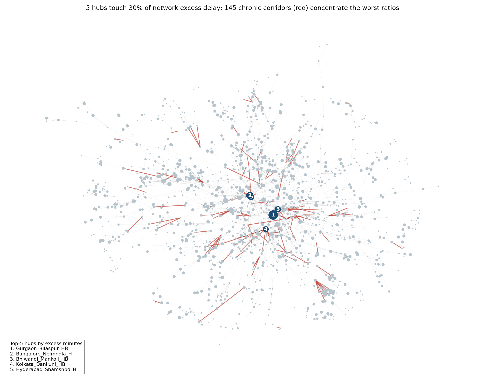
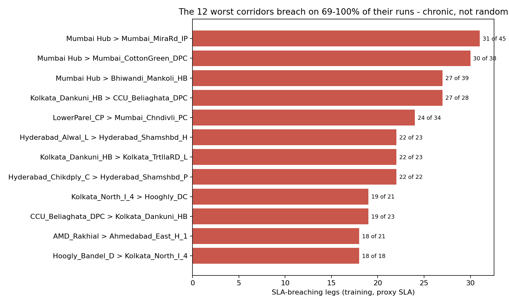
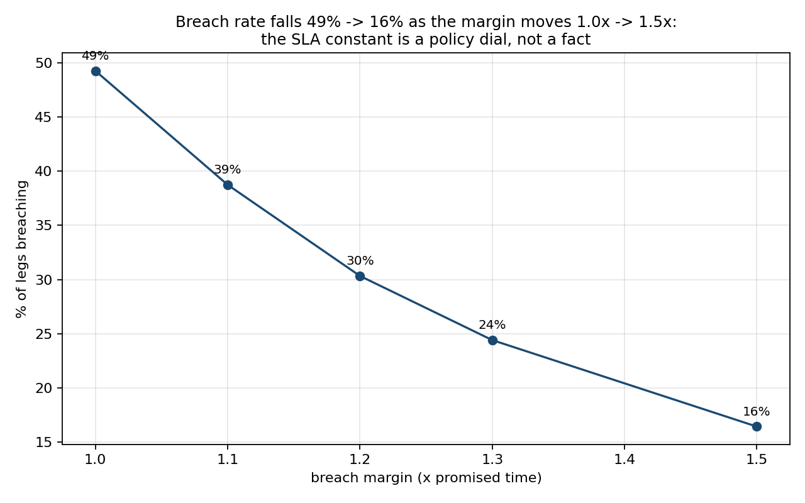
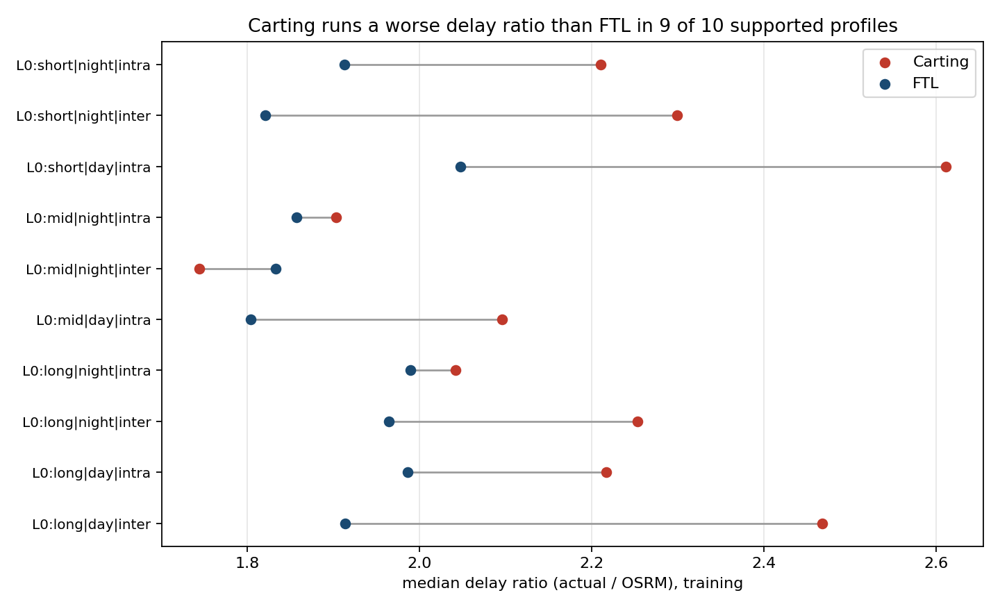

# Optimizing Delivery ETAs with Graph-Based Network Intelligence — Technical Report

**Dataset:** 144,867 scan rows → 26,369 corridor legs → 14,817 trips, Sep 12 – Oct 3, 2018 · **Split:** provided temporal split honored (train Sep 12–26, test Sep 27 – Oct 3, touched once per final model) · **Reproducibility:** cold re-run of the full pipeline reproduces all outputs bit-for-bit (MD5-verified); seeds fixed throughout · **Companion deliverables:** 2-page strategy memo (`network-ops-memo.pdf`), live dashboard (`app/network_console.py`)

## 1. Recommendations first

1. **Deploy the corridor calibration table this quarter.** OSRM misses actual transit by 107 min/leg (4.5% of legs within 15%). A per-corridor historical multiplier cuts this to 36 min (47%) with no ML; the full model reaches only 34 min (54%). The table is 95% of the achievable gain.
2. **Quote the 80th-percentile time.** Median quotes are kept ~half the time; p80 quotes were kept 78% on the held-out week at a median +15 min on the quote. The promise level is a pricing dial — presented as such.
3. **Fix three statistically stable hubs and twelve city corridors.** Gurgaon Bilaspur, Bangalore Nelmangala, Bhiwandi Mankoli survive 98–100% of bootstrap resamples; ranks 4–6 are a tie and are reported as one tier. Chronic corridors are 93% intra-state, 68% Carting — a city-distribution problem, not line-haul.

| Model (test week) | Leg MAE (min) | within ±15% | Cold-corridor MAE |
|---|---|---|---|
| M0 — OSRM as-is | 107.4 | 4.5% | 121.3 |
| M1 — corridor calibration table | 35.8 | 47.4% | 74.4 |
| M2 — strong tabular GBM | 34.4 | 53.3% | 136.3 |
| M3 — M2 + graph features | 34.4 | 53.7% | 135.8 |
| M3 with leaked full-data graph | 25.1 | 61.4% | — |

## 2. Data structure and the finding that reframed the brief

The file is scan-level: within each (trip, source, destination, od_start) leg, `actual_time`/`osrm_time` are cumulative counters (first-row cumulative = segment value in 26,368 of 26,368 legs — the decisive test) and the leg's max cumulative row is ground truth. 21 legs had broken scan sequences (repaired by max-aggregation, each logged); `factor` and `start_scan_to_end_scan` are target-derived and were dropped at ingestion. Full audit: `data-probe-findings.md`.

**The brief's chronic-delay threshold (actual > OSRM by 20%) flags 94.8% of legs**, because the median leg runs 2.0× OSRM — OSRM models driving while actual time includes ~2.4 h median handling dwell per leg-start. A threshold that flags everything ranks nothing. Replacement (registered before computing any ranking): a corridor is chronic if its **shrunken median delay ratio** sits in the top decile among corridors with ≥5 training runs. Shrinkage pulls each corridor's median toward its route-type norm with weight κ = 6 (the median corridor's run count), so a 1-run corridor with ratio 50.7 lands at 9.1 and cannot top the table on noise.

## 3. Graph and bottleneck audit

Directed graph from **training legs only**: 1,590 facilities, 2,508 corridors. Two centrality views are computed because they answer different questions — shortest-path betweenness (edge cost = median actual minutes) describes the map; observed throughput (trips chaining through a node) describes the traffic. **Their top-5 lists overlap on exactly one hub** (Gurgaon Bilaspur — the unambiguous #1). Hub ranking for action uses neither: hubs are ranked by total excess minutes on incident corridors — the quantity an ops leader can buy back.

Stability gate: under 1,000 corridor-cluster bootstrap resamples the top-3 persist in 98–100% of resamples; ranks 4–5 persist in 68.5% and 49.3% — **below the registered 80% gate, so the report names a top-3 and a watch-tier, not a false-precision top-5.** The three hubs need different fixes: Gurgaon is a pass-through chokepoint (throughput 86), Bhiwandi a volume terminal (most late legs, 399, with throughput 7), Bangalore a dwell problem (2.4 h median).

SLA proxy: no SLA exists in the data, so promised = OSRM × 2.0 (network median), breach = actual > promised × 1.2. The margin is a dial — breach rate runs 49%→16% across margins 1.0–1.5× — so all breach *levels* are conditional and only *rankings* are claimed.

## 4. The model contest, and the leak experiment that explains the field

Design registered before modeling: M3 − M2 is a same-learner ablation where M2 already contains each facility's own delay history (node-level aggregates), so M3 adds only *structural* information — centralities, node2vec embeddings (p=q=1, dim 32, seeded), neighborhood delay excluding the leg's own corridor. "Demonstrable advantage" was pre-defined: the 95% corridor-cluster bootstrap CI of MAE(M2)−MAE(M3) must exclude zero.

**Result: not demonstrable.** Overall −0.06 min, CI [−0.28, +0.14]; cold-start corridors +0.54 min, CI [−0.70, +1.98]. Network position adds nothing measurable beyond a facility's own history on this dataset.

**The leak experiment:** retraining M3 with graph artifacts computed on the *full* dataset — corridor medians, node aggregates and embeddings that have seen the test weeks' outcomes — improves test MAE from 34.4 to 25.1 (**27.1% flattering**) and within-15% from 53.7% to 61.4%. This is precisely what a pipeline without temporal discipline produces. The brief asks for the graph advantage to be "measured, not claimed"; the measurement is that the advantage is absent, and the apparent advantage other approaches will report is quantified contamination.

Two operational footnotes from the contest: gradient-boosted models collapse on unseen corridors (MAE ~136 vs the calibration table's 74 — trees overtrust corridor aggregates that are missing on cold-start), so deployment routes cold corridors to the multiplier fallback; and quantile models are well calibrated at p80 (78.1% empirical coverage, target 80%), making the promise dial real rather than aspirational.

## 5. FTL vs Carting framework

Exact-corridor overlap (both route types on the same corridor) covers 14 training corridors / 574 legs — registered as too thin and demoted to an exhibit (where FTL wins 7 of 14, a coin flip). The framework instead compares within **profile cells** (distance tercile × day/night dispatch × intra/inter-state); 10 of 12 cells clear a ≥30-legs-per-type support gate, covering 98.2% of legs.

FTL runs the better delay ratio in 9 of 10 supported profiles (observational — route type is chosen, not assigned). Raw minute comparisons mislead (FTL runs longer distances within the same cell); distance-held-fixed, Carting costs up to ~2 h extra on long daytime corridors. A planned model counterfactual (scoring legs with route type flipped) returned ~0 everywhere — the model treats route type as redundant given corridor history — so it is reported as a failed instrument, and the decision framework rests on the observational gaps plus volume economics: break-even ≈ FTL trip cost ÷ Carting per-kg rate ≈ 2,000 kg at the stated dials, with the delay penalty material only on long daytime corridors.

## 6. Limitations and scope (single section, no scattering)

22 non-peak days — festival-season behavior unobserved and likely worse; weekly seasonality at best. SLA, shipment value, intervention costs and the recoverable share of dwell are not in the data — every derived figure carries its dial, and the memo's impact table is a formula, not a point estimate. Route-type comparisons are observational. `actual_time`'s exact composition (transit vs partial dwell) is inferred from the od-window audit, not documented in the source. Aggregate features include own-leg for training rows (test metrics unaffected). 12.8% of consecutive trip legs do not chain (data gaps or unrecorded repositioning); throughput counts are conservative. GraphSAGE was not attempted (registered contingency: torch toolchain risk); node2vec parameterization was not tuned, to avoid a silent search over the test week.

## 7. Reproduction

`python scripts/00…05` in order (README has the exact commands); md → PDF via the repo converter. All 8 output CSVs verified to reproduce **bit-for-bit** on a cold re-run this session. The one exception is documented: node2vec embeddings require a temporary gensim install (gensim pins numpy<2); their seeded CSV artifacts are committed and consumed downstream. Method documents: pre-registered design + amendments (`analysis-design.md` §9), per-step logs with gates, and the probe report every structural claim cites.
